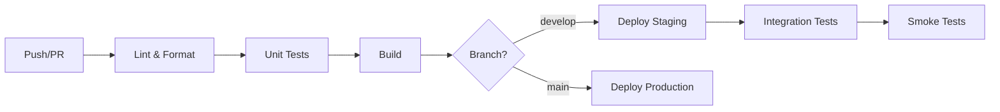

# SOP 07 — Deployment & CI/CD

> **Tujuan**: Menjamin proses deployment yang aman, repeatable, dan traceable.

---

## 🔄 CI/CD Pipeline



---

## 📋 Pipeline Stages

### 1. Lint & Format
```bash
gofmt -l .
golangci-lint run
swag fmt --dir ./internal/delivery/http/handler
```

### 2. Test
```bash
go test ./internal/... -v -race -coverprofile=coverage.out
```

### 3. Build
```bash
# Backend artifact (Linux binary)
CGO_ENABLED=0 GOOS=linux GOARCH=amd64 go build -o ./bin/api ./cmd/api

# Frontend artifact (static files)
cd frontend && npm ci && npm run build
```

### 4. Deploy
```bash
# Staging (upload backend binary + frontend dist)
scp ./bin/api user@staging-server:/opt/ecommerce/backend/api
scp -r ./frontend/dist user@staging-server:/opt/ecommerce/frontend/

# Production
scp ./bin/api user@prod-server:/opt/ecommerce/backend/api
scp -r ./frontend/dist user@prod-server:/opt/ecommerce/frontend/
```

---

## ⚙️ Run di Server dengan PM2 (Backend + Frontend)

```bash
# Install PM2 (sekali saja per server)
npm install -g pm2
npm install -g serve

# Jalankan backend (binary Go) lewat PM2
pm2 start /opt/ecommerce/backend/api --name ecommerce-backend

# Jalankan frontend static hasil build Vite (SPA mode)
pm2 serve /opt/ecommerce/frontend/dist 4173 --name ecommerce-frontend --spa

# Persist process list saat reboot
pm2 save
pm2 startup
```

Contoh verifikasi cepat:

```bash
pm2 status
pm2 logs ecommerce-backend --lines 100
pm2 logs ecommerce-frontend --lines 100
```

---

## 🗂️ Opsi `ecosystem.config.cjs` (Direkomendasikan)

Simpan file ini di server (misal: `/opt/ecommerce/ecosystem.config.cjs`) agar start/restart lebih konsisten:

```js
module.exports = {
  apps: [
    {
      name: "ecommerce-backend",
      script: "/opt/ecommerce/backend/api",
      cwd: "/opt/ecommerce/backend",
      instances: 1,
      autorestart: true,
      env: {
        ENVIRONMENT: "production",
        PORT: "8080"
      }
    },
    {
      name: "ecommerce-frontend",
      script: "serve",
      args: "-s /opt/ecommerce/frontend/dist -l 4173",
      cwd: "/opt/ecommerce/frontend",
      instances: 1,
      autorestart: true
    }
  ]
};
```

Jalankan:

```bash
pm2 start /opt/ecommerce/ecosystem.config.cjs
pm2 save
```

---

## 🔐 Environment Variables

| Variable | Deskripsi | Required |
|----------|-----------|----------|
| `ENVIRONMENT` | `development`, `staging`, `production` | ✅ |
| `PORT` | Port server backend (default: 8080) | ❌ |
| `MONGODB_URI` | MongoDB Atlas connection string | ✅ |
| `DB_NAME` | Nama database | ✅ |
| `JWT_SECRET` | Secret key untuk JWT | ✅ |
| `JWT_EXPIRED_HOURS` | JWT expiration jam (default: 24) | ❌ |
| `JWT_EXPIRATION_HOURS` | Alias lama JWT expiration (opsional) | ❌ |
| `SMTP_HOST` | SMTP server host | ❌ |
| `SMTP_PORT` | SMTP server port | ❌ |
| `SMTP_USER` | SMTP username | ❌ |
| `SMTP_PASS` | SMTP password | ❌ |
| `SMTP_SENDER_NAME` | Nama pengirim email | ❌ |
| `SMTP_SENDER_EMAIL` | Email pengirim | ❌ |

> ⚠️ **JANGAN PERNAH** commit `.env` file ke repository. Gunakan `.env.example` sebagai template.

---

## 🚀 Release Checklist

- [ ] Semua tests passed (unit + integration)
- [ ] Backend seed data sudah dijalankan untuk environment tujuan (jika perlu data awal)
- [ ] Swagger docs up to date
- [ ] Migration scripts ready (jika ada perubahan schema)
- [ ] Environment variables documented
- [ ] Changelog updated
- [ ] Version tag created
- [ ] Rollback plan documented

---

## 🔎 Local Deploy-Readiness Quick Check

```bash
# Backend
cd backend
make test
make build
make seed

# Frontend
cd ../frontend
npm run build
```

Smoke API setelah backend running:

```bash
curl http://localhost:8081/health
curl "http://localhost:8081/api/v1/categories"
curl "http://localhost:8081/api/v1/products?page=1&per_page=8"
```

---

*Terakhir diperbarui: 2026-05-06*
