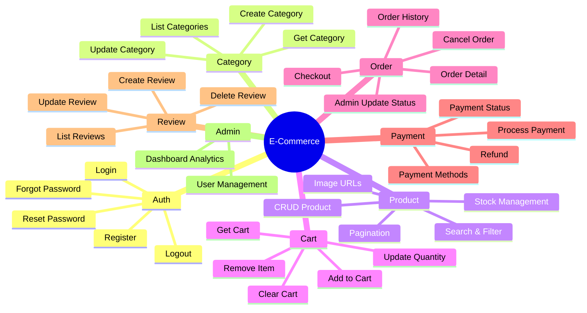
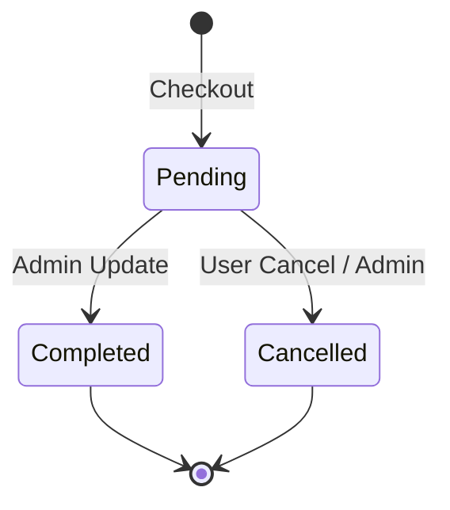

# 📋 Feature Summary — E-Commerce Backend

> **Ringkasan lengkap semua fitur platform E-Commerce beserta status implementasi.**

---

## 🗺️ Feature Map Overview



---

## 📊 Implementation Progress

| # | Feature | Status | Detail Doc |
|---|---------|--------|------------|
| 1 | Authentication & Authorization | ✅ Done | [auth.md](auth.md) |
| 2 | Category Management | ✅ Done | [category.md](category.md) |
| 3 | Product Catalog | ✅ Done | [product-catalog.md](product-catalog.md) |
| 4 | Shopping Cart | ✅ Done | [shopping-cart.md](shopping-cart.md) |
| 5 | Order Management | ✅ Done | [order-management.md](order-management.md) |
| 6 | Payment | 📋 Planned | — |
| 7 | Reviews & Ratings | 📋 Planned | — |
| 8 | Admin Panel (advanced) | 📋 Planned | — |
| 9 | Frontend Landing Page (Luxury Glassmorphism) | ✅ Done | [09-frontend-landing/00-README.md](09-frontend-landing/00-README.md) |

---

## 📊 Feature Details

### 🔐 1. Authentication & Authorization

| Fitur | Method | Endpoint | Status | Priority |
|-------|--------|----------|--------|----------|
| Register | POST | `/api/v1/auth/register` | ✅ Done | 🔴 High |
| Login | POST | `/api/v1/auth/login` | ✅ Done | 🔴 High |
| Forgot Password | POST | `/api/v1/auth/forgot-password` | ✅ Done | 🟡 Medium |
| Reset Password | POST | `/api/v1/auth/reset-password` | ✅ Done | 🟡 Medium |
| Logout | POST | `/api/v1/auth/logout` | ✅ Done | 🟡 Medium |
| Refresh Token | POST | `/api/v1/auth/refresh` | 📋 Planned | 🔴 High |

**Implementasi:**
- JWT token dengan configurable expiration
- Password hashing via bcrypt
- Token blocklist (logout) dengan TTL index
- Forgot/Reset password via email service
- Auth middleware + Role-based access control

---

### 🏷️ 2. Category Management

| Fitur | Method | Endpoint | Status | Priority |
|-------|--------|----------|--------|----------|
| List Categories | GET | `/api/v1/categories` | ✅ Done | 🔴 High |
| Get Category | GET | `/api/v1/categories/{id}` | ✅ Done | 🔴 High |
| Create Category | POST | `/api/v1/categories` | ✅ Done | 🟡 Medium |
| Update Category | PUT | `/api/v1/categories/{id}` | ✅ Done | 🟡 Medium |

**Implementasi:**
- Nama kategori unik (duplicate check)
- GET endpoints bersifat publik
- Create/Update membutuhkan admin role

---

### 📦 3. Product Catalog

| Fitur | Method | Endpoint | Status | Priority |
|-------|--------|----------|--------|----------|
| List Products | GET | `/api/v1/products` | ✅ Done | 🔴 High |
| Get Product | GET | `/api/v1/products/{id}` | ✅ Done | 🔴 High |
| Create Product | POST | `/api/v1/products` | ✅ Done | 🔴 High |
| Update Product | PUT | `/api/v1/products/{id}` | ✅ Done | 🔴 High |
| Delete Product | DELETE | `/api/v1/products/{id}` | ✅ Done | 🟡 Medium |
| Search Products | GET | `/api/v1/products?q=keyword` | ✅ Done | 🔴 High |

**Implementasi:**
- Pagination (default 20/page)
- Filter: category, min/max price, in_stock
- Search: keyword (regex pada nama produk)
- Validasi category_id ke CategoryRepository
- Minimal 1 gambar (URL), harga > 0, stok >= 0
- Admin-only untuk create/update/delete

---

### 🛒 4. Shopping Cart

| Fitur | Method | Endpoint | Status | Priority |
|-------|--------|----------|--------|----------|
| Get Cart | GET | `/api/v1/cart` | ✅ Done | 🔴 High |
| Add to Cart | POST | `/api/v1/cart/items` | ✅ Done | 🔴 High |
| Update Quantity | PUT | `/api/v1/cart/items/{productId}` | ✅ Done | 🔴 High |
| Remove Item | DELETE | `/api/v1/cart/items/{productId}` | ✅ Done | 🔴 High |
| Clear Cart | DELETE | `/api/v1/cart` | ✅ Done | 🟡 Medium |

**Implementasi:**
- 1 user = 1 active cart
- Stok dicek saat add/update (tanpa reserve)
- Harga selalu diambil dari data produk terbaru
- `image_url` diambil dari `product.Images[0]` saat add/update, dan di-populasi dinamis saat GetCart untuk data lama
- Quantity <= 0 otomatis remove item
- Optimistic locking via version field
- Cart auto-clear setelah checkout

---

### 📑 5. Order Management

| Fitur | Method | Endpoint | Status | Priority |
|-------|--------|----------|--------|----------|
| Checkout | POST | `/api/v1/orders` | ✅ Done | 🔴 High |
| List Orders | GET | `/api/v1/orders` | ✅ Done | 🔴 High |
| Get Order | GET | `/api/v1/orders/{id}` | ✅ Done | 🔴 High |
| Cancel Order | PUT | `/api/v1/orders/{id}/cancel` | ✅ Done | 🟡 Medium |
| Update Status (Admin) | PUT | `/api/v1/admin/orders/{id}/status` | ✅ Done | 🟡 Medium |

**Implementasi:**
- Checkout: cart → validasi stok → deduct stok → create order → clear cart
- Order status state machine: `pending → completed | cancelled`
- Cancel restores stock (non-fatal per item)
- Ownership validation (hanya pemilik atau admin)
- Pagination (default 20, max 100)

**Order Status Flow:**


---

### 💳 6. Payment

| Fitur | Method | Endpoint | Status | Priority |
|-------|--------|----------|--------|----------|
| Get Payment Methods | GET | `/api/v1/payments/methods` | 📋 Planned | 🟡 Medium |
| Process Payment | POST | `/api/v1/payments` | 📋 Planned | 🔴 High |
| Payment Status | GET | `/api/v1/payments/:id` | 📋 Planned | 🔴 High |
| Payment Callback | POST | `/api/v1/payments/callback` | 📋 Planned | 🔴 High |

---

### ⭐ 7. Reviews & Ratings

| Fitur | Method | Endpoint | Status | Priority |
|-------|--------|----------|--------|----------|
| Create Review | POST | `/api/v1/products/:id/reviews` | 📋 Planned | 🟡 Medium |
| List Reviews | GET | `/api/v1/products/:id/reviews` | 📋 Planned | 🟡 Medium |
| Update Review | PUT | `/api/v1/reviews/:id` | 📋 Planned | 🟢 Low |
| Delete Review | DELETE | `/api/v1/reviews/:id` | 📋 Planned | 🟢 Low |

**Business Rules:**
- Hanya bisa review setelah order status = Completed
- 1 user = 1 review per product
- Rating: 1-5 stars

---

### 🛡️ 8. Admin Panel

| Fitur | Method | Endpoint | Status | Priority |
|-------|--------|----------|--------|----------|
| List Users | GET | `/api/v1/admin/users` | 📋 Planned | 🟡 Medium |
| Ban User | PUT | `/api/v1/admin/users/:id/ban` | 📋 Planned | 🟢 Low |
| List All Orders | GET | `/api/v1/admin/orders` | 📋 Planned | 🟡 Medium |
| Dashboard Stats | GET | `/api/v1/admin/dashboard` | 📋 Planned | 🟢 Low |

> **Note:** Beberapa admin endpoint sudah diimplementasi sebagai bagian dari fitur lain:
> - Admin order status update → `/api/v1/admin/orders/{id}/status` (✅ Done, di Order Management)
> - Admin CRUD product → di Product Catalog (✅ Done)
> - Admin CRUD category → di Category Management (✅ Done)

---

### 🎨 9. Frontend Landing Page (React + TypeScript)

| Fitur | Scope | Status | Priority |
|-------|-------|--------|----------|
| Premium Hero Section | Glassmorphism hero + CTA + floating cards | ✅ Done | 🔴 High |
| Featured Categories | Curated + API-driven category cards | ✅ Done | 🔴 High |
| New Arrivals Grid | Product cards + quick add-to-cart | ✅ Done | 🔴 High |
| Limited Edition Banner | Countdown + drop CTA | ✅ Done | 🟡 Medium |
| Best Seller Carousel | Horizontal luxury card carousel | ✅ Done | 🟡 Medium |
| Why Choose Us | Feature cards with iconography | ✅ Done | 🟡 Medium |
| Fashion Lookbook | Editorial campaign layout | ✅ Done | 🟡 Medium |
| Testimonials | Review cards + ratings | ✅ Done | 🟢 Low |
| Newsletter + Mobile + Footer | Conversion and support sections | ✅ Done | 🟡 Medium |

**Implementasi Frontend:**
- React + TypeScript via Vite
- Tailwind utility workflow + custom glass styling
- Local premium fonts: Syne + Manrope
- Service/hook architecture (`services/`, `hooks/`)
- API integration ke backend endpoint:
  - `GET /api/v1/products`
  - `GET /api/v1/categories`
  - `POST /api/v1/cart/items` (quick add, auth-aware)

---

## 📈 Status Legend

| Icon | Status |
|------|--------|
| 📋 | Planned — Belum dikerjakan |
| 🔨 | In Progress — Sedang dikerjakan |
| ✅ | Done — Selesai & tested |
| 🔴 | High Priority |
| 🟡 | Medium Priority |
| 🟢 | Low Priority |

---

## 🏗️ Architecture Implemented

```
backend/internal/
├── config/        → App config (env vars)
├── domain/        → Entities, Interfaces, DTOs, Errors, Constants
├── usecase/       → Business logic (5 use cases + tests)
├── repository/    → MongoDB implementations (5 repos + tests)
├── delivery/http/ → Handlers, Middleware, Router, Response helpers
└── pkg/           → hash, token, mail, validator, mongodb
```

**Clean Architecture compliance:**
- ✅ Domain layer has zero external dependencies
- ✅ UseCase imports only domain interfaces
- ✅ Repository implements domain interfaces
- ✅ Handler depends on UseCase interfaces only
- ✅ Swagger annotations on all handler endpoints

---

*Terakhir diperbarui: 2026-05-20*
